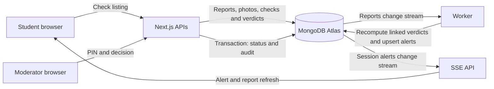

# ScamRing

ScamRing helps students check suspicious rental listings against linked reports. Paste a listing or chat message, optionally upload photos, and receive a risk score with the evidence behind it. A moderator can confirm a linked scam and trigger alerts for the people who checked those listings.

Built for MongoDB Builder Day Dublin. One Next.js app and one worker use MongoDB Atlas as the database, search engine and event bus.

## Why this matters

An Garda Síochána reported over 230 rental and reservation scam reports and losses above €400,000 from January through July 2026. Its warning identifies August to October as a seasonal peak for student accommodation fraud. [Garda warning, 25 August 2026](https://www.garda.ie/en/about-us/our-departments/office-of-corporate-communications/press-releases/2026/august/25-08-2026-an-garda-siochana-issues-student-fraud-warning-ahead-of-cao-offers-25th-august-2026.html).

A listing may look ordinary on its own. Shared contact identifiers, reused photos and copied descriptions can connect it to other reports. ScamRing makes those connections visible before a student decides to pay.

## What works and what remains

| Surface | Implementation | Verification or remaining gate |
| --- | --- | --- |
| Ingestion and check API | JSON/multipart input, photo clustering, identifier extraction, verdict and anonymous check record | Repository API tests passed |
| Ring detection | Indexed identifier traversal, report/identifier graph endpoint | Traversal tests and index scan check passed |
| Verdicts | Five evidence signals, LOW/MEDIUM/HIGH levels, optional model summary | Repository verdict tests passed; full shared-seed calibration pending |
| Moderation | PIN validation, status and audit event in one transaction, confirmation removes report expiry | Integrated Atlas sandbox checks passed |
| Realtime | Retry-safe fan-out, worker resume token, session SSE, catch-up and polling fallback | Integrated sandbox delivery, deduplication, pagination and restart checks passed |
| Moderation and live pages | Queue decisions and public feed containing only area, price, level, status and timestamp | Browser checks passed before the latest frontend handoff |
| Alert toast | Component and report refresh event implemented | Isolated browser checks passed; C must mount it and connect verdict state |
| Check/report frontend | Form, demo presets, verdict and ring components now present | Current frontend needs the shared-data browser rehearsal |
| Proof page | Counts, index and query evidence endpoints/components present | Verify against the prepared shared database |
| Release scripts | Calibration targets and real HTTP smoke checks | Shared calibration and smoke still pending |

The 24 repository tests, build, TypeScript and Lane D lint checks passed in the last verification. The full two-browser MEDIUM-to-HIGH demo is an acceptance gate, not a completed claim.

## Signals and scoring

The table reflects the current source, which differs from the initial prompt's fixed weights. Scores add up and cap at 100. LOW is below 30, MEDIUM is 30–69, and HIGH is 70 or above. These levels describe evidence, not certainty that a person committed fraud.

| Signal | Current points | Evidence |
| --- | --- | --- |
| `ring_link` | 45 with a confirmed linked scam; otherwise 10 for a cluster with at least two other reports | Shared phone, email, payment handle, bank identifier or photo cluster and hop count |
| `photo_reuse` | 35 | A photo cluster appears in another listing with a different area or materially different price |
| `text_clone` | 20; 25 when a matching report is confirmed | Vector similarity at least 0.92 for sufficiently long descriptions |
| `script_match` | 10; 20 for a strong match | Vector thresholds 0.88/0.93, or a keyword fallback using paraphrased scam patterns |
| `price_low` | 15; 25 below half the reference price | At least 35% below the rent reference; current room reference is 55% of the relevant RTB average |

Signal constants belong to A/B. `scripts/calibrate.ts` prints exported thresholds, score distributions and the seed-ring versus risk-level table without changing those constants. Targets: every ring listing at least MEDIUM, unconfirmed ring B MEDIUM, and at least 95% of legitimate seed listings LOW.

## Architecture and MongoDB features



| MongoDB feature | Role in ScamRing | Where to inspect |
| --- | --- | --- |
| Multikey index and `$graphLookup` | Traverse shared identifiers, with `maxDepth: 2` and a cap of 60 reports | `lib/ring.ts`, `reports.identifiers_1` |
| Four indexed photo hash bands | Find candidates before checking 64-bit dHash distance | `lib/photos.ts`, `lib/dhash.ts`, `photos.b0` through `b3` |
| Automated Embedding and `$vectorSearch` | Find copied descriptions and known scam scripts | `lib/vector.ts`, `reports_text_vec`, `patterns_vec` |
| Aggregation over rent baselines | Select the RTB rent reference for the current price signal | `lib/signals/priceLow.ts`, `rent_baseline` |
| Multi-document transaction | Commit the moderation decision and audit record together | `app/api/moderation/[id]/route.ts` |
| Change streams | Drive confirmation fan-out and session alert delivery | `scripts/worker.ts`, `app/api/stream/route.ts` |
| Unique compound index | Deduplicate delivery across retries and concurrent inline/worker processing | `lib/fanout.ts`, alerts keyed by session/report/trigger |
| TTL index | Expire non-seed pending reports after 30 days | `scripts/setup-db.ts`, `reports.expiresAt` |

The initial plan proposed `$median` for room prices. The current price signal uses RTB averages with a room factor instead, so this README does not claim a median-based signal. Traversal starts with the first matching reports, so `maxDepth: 2` can expose up to three report hops; see CONTRACT.md.

## Privacy and limits

Contact identifiers use HMAC-SHA256 with a shared `IDENTIFIER_SECRET`. Stored listing text redacts the recognized contacts, and display hints retain only the kind and last two characters. Photo identifiers refer to clusters rather than HMAC contact values. Report responses and the moderation queue omit the contact identifier array.

The ring graph uses hashed identifier IDs and masked hints. Hashes still permit linkage and are not anonymous against a compromised secret. Uploaded photos are retained as resized images; photo reuse is a similarity signal, not identity proof.

The `sr_sid` cookie creates an anonymous session for check records and alerts. SSE and polling return alerts for that session. The public live feed omits listing text, contact identifiers and session IDs.

Only non-seed pending report documents receive a 30-day expiry. Confirmation removes that expiry. MongoDB TTL deletion is asynchronous and does not cascade to photo, check or alert records. The audit collection records moderation actions. The shared PIN, including its browser localStorage persistence, is demo authentication and must be replaced before a public release.

## Run locally

Requirements: Node.js 22+, npm, and an Atlas connection or local replica set supporting transactions and change streams. Use the same identifier secret as the team so records link consistently.

```sh
npm ci
test -f .env || cp .env.example .env
```

Edit `.env` privately:

| Variable | Purpose |
| --- | --- |
| `MONGODB_URI` | Atlas database-user connection string |
| `IDENTIFIER_SECRET` | Team's shared, long random HMAC secret |
| `DB_NAME` | Exact database name: shared `scamring`, or `scamring_a` through `scamring_d` |
| `MODERATOR_PIN` | Private demo PIN entered at `/moderate`; fallback is `1234` if unset |
| `FANOUT_INLINE` | `0` with the worker; `1` for inline fan-out fallback |
| `DEMO` | `1` enables the frontend demo presets |
| `ANTHROPIC_API_KEY` | Optional summary only; the app works without it |
| `ANTHROPIC_MODEL` | Optional summary model, with the template's default |

Use `.env`. Some A/B scripts still call dotenv on `.env.local`, so the commands below explicitly preload `.env` using Node. Existing process variables, including a `DB_NAME=...` override, take precedence. Remove or reconcile a stale `.env.local` locally because Next.js can load it ahead of `.env`. Keep secrets out of both commits and chat. Ignoring a file does not untrack a previously committed file.

### Prepare a personal sandbox

Coordinate the database setup with A and the data preparation with B. The following commands write only to `scamring_d`. Import resets its report/photo/check/alert/audit data. Do not run the import over data you need to keep.

```sh
DB_NAME=scamring_d node --env-file=.env --import tsx scripts/ping.ts
DB_NAME=scamring_d node --env-file=.env --import tsx scripts/setup-db.ts
node public/demo/prepare-photos.mjs
DB_NAME=scamring_d node --env-file=.env --import tsx scripts/load-rents.ts
DB_NAME=scamring_d node --env-file=.env --import tsx scripts/seed-patterns.ts
DB_NAME=scamring_d node --env-file=.env --import tsx scripts/gen-seed.ts
DB_NAME=scamring_d node --env-file=.env --import tsx scripts/import-seed.ts
DB_NAME=scamring_d npm run dev:all
```

The photo preparation command downloads missing source photos, preserves valid ones and creates the transformed demo image. Shared vector indexes have priority on the free Atlas cluster; ask A before creating additional sandbox search indexes. Full clone similarity and score calibration require queryable vector indexes. Script matching has a keyword fallback if vector search is unavailable. For a sandbox import without computing every verdict, append `--no-verdicts`; those verdicts then still need computation before a scored demo.

Open http://localhost:3000 for checks, `/report/<id>` for a report and its ring, `/moderate` for decisions, `/live` for the feed and `/under-the-hood` for database evidence. Enter the configured PIN in `/moderate`.

### Shared demo preparation

Everyone uses `DB_NAME=scamring`, the same identifier secret and the prepared seed/photo files. A owns index setup. B announces a shared reset before running the data commands. The examples below are for the designated owners, not routine local testing:

```sh
# A: create/check shared indexes.
DB_NAME=scamring node --env-file=.env --import tsx scripts/setup-db.ts
# B: coordinate writes and reset before running these.
DB_NAME=scamring node --env-file=.env --import tsx scripts/load-rents.ts --shared
DB_NAME=scamring node --env-file=.env --import tsx scripts/seed-patterns.ts --shared
DB_NAME=scamring node --env-file=.env --import tsx scripts/gen-seed.ts
DB_NAME=scamring node --env-file=.env --import tsx scripts/import-seed.ts --shared
```

Wait for the vector indexes and seed queries to be ready. If the Atlas embedding rate limit prevents full import scoring, B can use `--no-verdicts` and coordinate subsequent calibration with A/D. Reseed after smoke and rehearsals, before the final demo.

## Checks and demo acceptance

```sh
npm run build
npx tsc --noEmit
# Database-writing repository tests refuse the shared database.
DB_NAME=scamring_a node --env-file=.env --import tsx --test tests/*.test.ts
# D: recomputes stored seed verdicts on the selected database.
DB_NAME=scamring node --env-file=.env --import tsx scripts/calibrate.ts
# Server, worker and smoke must use the same prepared shared database and PIN.
DB_NAME=scamring npm run dev:all
# In a second terminal, after coordinating with B:
DB_NAME=scamring BASE_URL=http://localhost:3000 node --env-file=.env --import tsx scripts/smoke.ts --shared
```

Smoke creates checks/reports and confirms a linked ring B report. It expects MEDIUM for the ring B check, HIGH for reused ring A photos, LOW for an ordinary listing, and a matching alert plus HIGH verdict within three seconds of confirmation. It exits nonzero if any step fails. B must reseed afterward.

For the browser acceptance, C mounts the default export `@/components/AlertToast` once in the layout and wires verdict state to `scamring:report-updated` or refetches on `scamring:alert`. Test with two separate sessions: check a ring B listing in one, confirm a linked report in the other, and observe the toast and HIGH verdict within two seconds. Restart the worker and verify offline confirmation recovery without duplicate alerts. If the worker is unreliable, restart the server with `FANOUT_INLINE=1`. After two SSE errors the alert hook falls back to polling every three seconds, so do not describe the fallback as subsecond delivery.

The detailed Lane D integration tests previously used a temporary local harness, not a committed test file. See [SUBMISSION.md](SUBMISSION.md) for remaining gates, and [the four-slide deck](docs/pitch.html) for presentation mode and speaker notes. [PDF slides](docs/ScamRing-pitch.pdf) are the offline backup.

## Data sources

- Rent references: [CSO table RIQ02](https://data.cso.ie/table/RIQ02), RTB average monthly rents. The loader selects the latest available quarter or uses the documented bundled fallback.
- Scam scripts: ten paraphrased warnings in [seed/patterns.json](seed/patterns.json), with provenance in [seed/patterns-sources.md](seed/patterns-sources.md).
- Photos: fixed Unsplash sources and the license link in [public/demo/photo-sources.json](public/demo/photo-sources.json). See the [Unsplash license](https://unsplash.com/license).
- Listings: deterministic synthetic fixtures, currently 150 legitimate listings and rings of 8, 6 and 5. Contacts use UK drama-range phone numbers, example.com/example.org emails and demo payment handles. They are test data, not allegations about real advertisers.

## Known limitations and next steps

The corpus and acceptance targets are synthetic. The prototype has no measured real-world fraud accuracy. Missing vector search can reduce evidence, and a LOW result does not certify a listing. Common agency contacts can connect unrelated listings and need weighting. Photo hashes can miss heavy edits or group visually similar images. Room rent estimates use a fixed factor of registered rents rather than a direct room-market measure.

The worker stores one shared resume token per database, so run one worker for the demo database. An expired or invalid change-stream token needs an operator recovery procedure. Authentication, retention of dependent records, abuse prevention and production operations need further work.

Next steps are student-union moderator accounts, WhatsApp/Telegram intake, identifier weighting, comprehensive retention cleanup and evaluation on independently labelled listings.

## Team and release

A owns the core database, ingest and verdict work. B owns data, seed and signal work. C owns frontend and layout integration. D owns moderation, realtime, calibration/smoke, README, submission and the pitch.

Stage explicit paths, inspect the staged diff, commit small changes and pull with rebase before pushing. Keep `.env` and `.env.local` out of the commit. The repository currently tracks private env paths, so the team must untrack them and rotate any committed credentials. Do not force-push.
