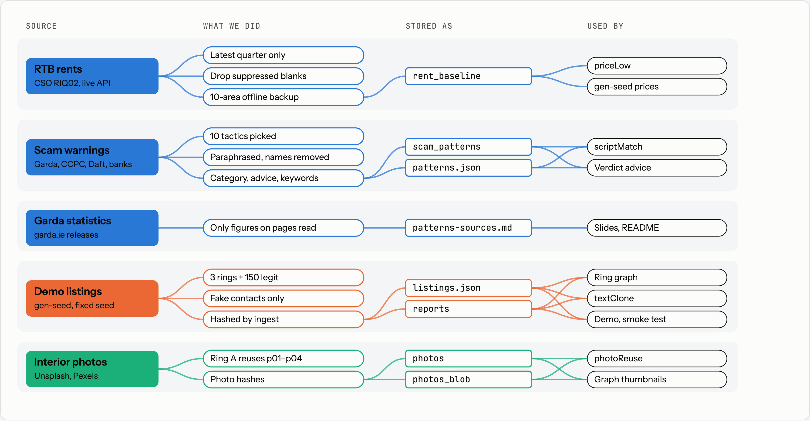
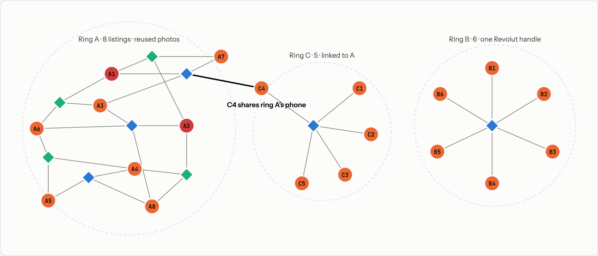

# Seed data

ScamRing's demo runs on real Irish rents and real scam scripts, combined with synthetic contact details so no real person's phone or email ends up in a scam ring.

## Data flow

Each source, what we did to it, where it is stored, and what reads it.



| File | Holds | Made by |
| --- | --- | --- |
| `riq02` (live) / `rents-fallback.json` | RTB average monthly rents, 2025Q4 | `scripts/load-rents.ts` |
| `patterns.json` | 10 paraphrased scam scripts with category, advice, keywords and source URL | hand-curated, loaded by `scripts/seed-patterns.ts` |
| `patterns-sources.md` | the page each pattern and statistic came from | hand-curated |
| `listings.json` | 169 demo listings | `scripts/gen-seed.ts`, imported by `scripts/import-seed.ts` |

## How the scam rings are built

Listings (circles) link through what they share (diamonds): a phone, an email, a Revolut handle or a reused photo. Ingest stores each of these only as an HMAC hash.



Orange circles are pending scam listings, red circles are confirmed scams, blue diamonds are shared contacts and green diamonds are reused photos.

The 150 legit listings share nothing, so they never appear in a ring. `gen-seed` refuses to write `listings.json` unless every ring is fully linked within 2 hops and every legit listing is isolated, and `import-seed` checks `getRing` returns exactly those members.

| Group | Built to show | Target verdict |
| --- | --- | --- |
| Ring A | photo reuse plus confirmed scams | HIGH |
| Ring B | linked but unconfirmed; a moderator confirms one live in the demo | MEDIUM, then HIGH |
| Ring C | linked to ring A through one shared phone | MEDIUM or higher |
| Legit | market-rate prices, ordinary wording | LOW |

## Privacy

- Seed phones, emails and handles are invented. Real ones from scam reports often belong to innocent people whose numbers were spoofed.
- Contacts are stored only as HMAC-SHA256 hashes; the ring graph shows masked hints such as `+353 ** *** 0193`.
- Scam scripts are paraphrased, and no individual is named in `patterns-sources.md`.

## Regenerate

```bash
npx tsx scripts/load-rents.ts          # add --shared for the shared database
npx tsx scripts/seed-patterns.ts       # add --shared for the shared database
npx tsx scripts/gen-seed.ts            # rewrites listings.json (deterministic)
npx tsx scripts/import-seed.ts         # resets report data; --shared needs a chat warning first
```
